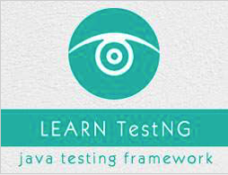

```
Roberto Nogueira  
BSd EE, MSd CE
Solution Integrator Experienced - Certified by Ericsson
```
# TutorialsPoint TestNG



**About**

Learn everything you need to about the subject of this `Tutorialspoint` project.

[Homepage](https://www.tutorialspoint.com/testng/index.htm)

## Topics
```
TestNG Tutorial
[ ] Home
[ ] Overview
[ ] Environment
[ ] Writing Tests
[ ] Basic Annotations
[ ] Execution Procedure
[ ] Executing Tests
[ ] Suite Test
[ ] Ignore Test
[ ] Group Test
[ ] Exception Test
[ ] Dependency Test
[ ] Parameterized Test
[ ] Run JUnit Tests
[ ] Test Results
[ ] Plug with ANT
[ ] Plug with Eclipse
TestNG Useful Resources
[ ] Quick Guide
[ ] Useful Resources
[ ] Discussion
Selected Reading
[ ] Developer's Best Practices
[ ] Questions and Answers
[ ] Effective Resume Writing
[ ] HR Interview Questions
[ ] Computer Glossary
[ ] Who is Who
```
